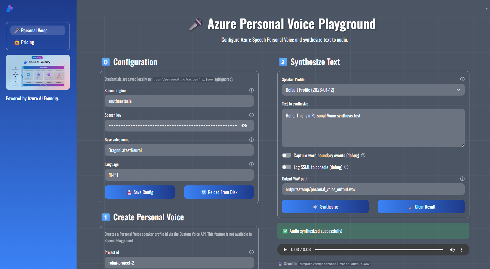

# Azure Personal Voice Playground

A Streamlit-based playground for testing Azure Speech Service's Personal Voice feature. Create custom text-to-speech voices using your own audio samples, manage speaker profiles, and synthesize speech with personalized voices.

## 📋 Prerequisites

- **Python 3.11+** (required for modern type hints and async features)
- **Azure Speech Service** subscription (with Personal Voice enabled)
- **uv** (recommended) or pip for package management
- **Make** (optional, for convenient task commands)
  - Windows: `choco install make` or use WSL
  - Linux/macOS: pre-installed

## 🔧 Installation

1. **Clone the repository:**
```bash
git clone https://github.com/robrita/Unified-Azure-Voice-Playground.git
cd Unified-Azure-Voice-Playground
```

2. **Install dependencies:**
```bash
uv sync
```

3. **Configure Azure Speech credentials:**

Create a `.env` file or configure through the UI:
```bash
AZURE_SPEECH_REGION=eastus
AZURE_SPEECH_KEY=your_speech_key_here
```

## 🚀 Usage

### Quick Start (Recommended)
```bash
# Install dependencies
make install

# Format code and run app
make run
```

### Common Commands

| Command | Purpose |
|---------|---------|
| `make run` | Start the Streamlit app |
| `make format` | Auto-fix lint issues and format code |
| `make lint` | Check code style (no changes) |
| `make test-unit` | Run fast unit tests |
| `make test-cov` | Generate coverage report |
| `make check-and-run` | Validate code style and launch the app | 

### Direct Commands (without Make)
```bash
# Run application
uv run streamlit run app.py

# Code quality
uv run ruff check --fix .
uv run ruff format .

# Testing
uv run pytest -m unit -v
uv run pytest --cov --cov-report=html
```

The application opens at `http://localhost:8501`

## ✨ Features

### 0️⃣ Configuration
- Store Azure Speech credentials locally (gitignored)
- Configure base voice name and language
- Manage speaker profiles with friendly names
- Persistent configuration across sessions

### 1️⃣ Create Personal Voice
- Create speaker profiles using Azure Custom Voice API
- Upload consent audio with verbal statement
- Upload prompt audio samples (5-90 seconds)
- Automatic speaker profile ID generation
- Profile management with friendly names

### 2️⃣ Synthesize Text
- Select from saved speaker profiles
- Enter text to synthesize
- Generate personalized speech audio
- Download synthesized audio as WAV files
- Debug options (word boundaries, SSML logging)

### 💰 Pricing
- View Azure Speech Service pricing information
- Compare Neural TTS vs Personal Voice features
- Access official pricing calculator

## 🛠️ Technology Stack

- **Framework:** Streamlit 1.50.0 (Python web app framework)
- **Speech Service:** Azure Cognitive Services Speech SDK 1.38.0+
- **API Integration:** Azure Custom Voice REST API
- **Configuration:** Pydantic 2.10.6+ for data validation
- **Package Manager:** uv + pyproject.toml (10-100x faster than pip)
- **Code Quality:** Ruff (fast Python linter & formatter)
- **Testing:** pytest with unit tests
- **Environment:** python-dotenv for secure credential management

## 🔒 Security

- **Environment Variables:** All sensitive credentials stored in `.env` (git-ignored)
- **Local Configuration:** Speech credentials saved locally in `.conf/personal_voice_config.json` (git-ignored)
- **No Hardcoded Secrets:** Azure endpoints and keys loaded at runtime
- **Secure File Handling:** Audio files temporarily saved under `outputs/temp/` during processing
- **Input Validation:** Pydantic schemas enforce strict data validation
- **Consent Required:** Personal Voice creation requires explicit user consent via recorded audio statement

## 🤝 Contributing

Contributions are welcome! Please follow these guidelines:

1. **Fork** the repository and create a feature branch
2. **Format** your code: `make format`
3. **Test** your changes: `make test-unit`
4. **Follow** code quality standards (see [AGENTS.md](AGENTS.md))
5. **Submit** a Pull Request with a clear description

See `.github/instructions/` for detailed development guidelines.

## 📝 License

This project is open source and available under the **MIT License**.

## 📧 Support

For support, please [open an issue](https://github.com/robrita/Unified-Azure-Voice-Playground/issues) in the GitHub repository.

## 🔗 Useful Links

- [Azure Speech Service Documentation](https://learn.microsoft.com/azure/ai-services/speech-service/)
- [Personal Voice Overview](https://learn.microsoft.com/azure/ai-services/speech-service/personal-voice-overview)
- [Custom Voice API Reference](https://learn.microsoft.com/azure/ai-services/speech-service/rest-text-to-speech)
- [Azure Speech Pricing](https://azure.microsoft.com/en-us/pricing/details/cognitive-services/speech-services/)

## 🙏 Acknowledgments

Built with modern Python tools and Azure AI services:
- [Streamlit](https://streamlit.io/) - Web application framework
- [Azure Speech Service](https://azure.microsoft.com/en-us/products/ai-services/speech-services/) - Personal Voice text-to-speech
- [uv](https://github.com/astral-sh/uv) - Fast Python package manager
- [Ruff](https://github.com/astral-sh/ruff) - Lightning-fast Python linter