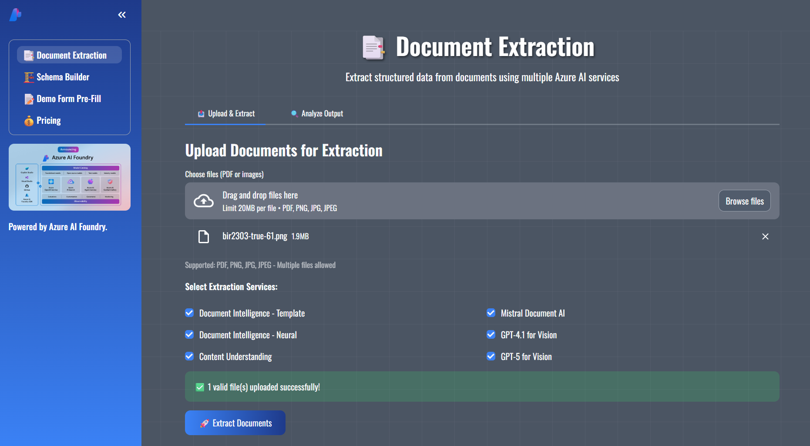
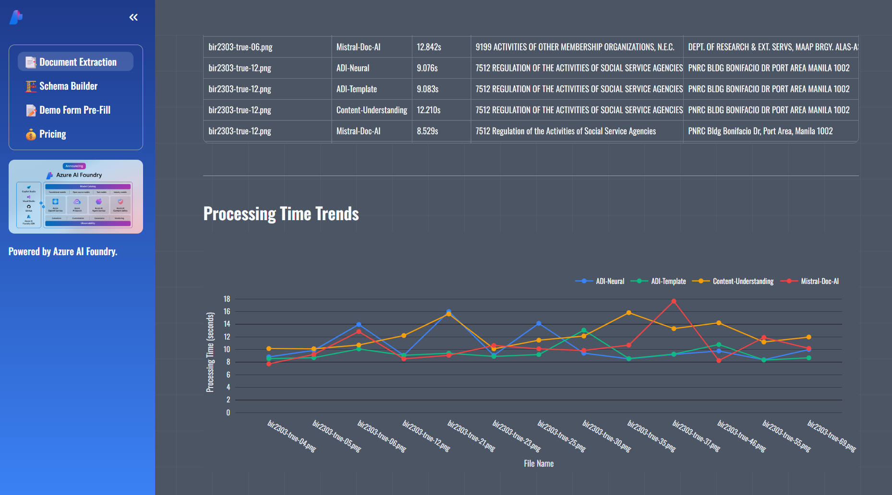

## 📋 Prerequisites

- **Python 3.11+** (required for modern type hints and async features)
- **uv** (recommended) or pip for package management
- **Make** (optional, for convenient task commands)
  - Windows: `choco install make` or use WSL
  - Linux/macOS: pre-installed

## 🔧 Installation

1. **Clone the repository:**
```bash
git clone --branch doc-extraction https://github.com/robrita/azdemo.git doc-extraction
cd doc-extraction
```

2. **Install dependencies:**
```bash
uv sync
```

3. **Configure Azure services** (optional - see `.env.example`):
```bash
# Copy template and add your credentials
cp .env.example .env
```

All Azure services are optional. Unconfigured services will be marked as unavailable in the UI.

## 🚀 Usage

### Quick Start (Recommended)
```bash
# Install dependencies
make install

# Format code and run app
make run
```

### Common Commands

| Command | Purpose |
|---------|---------|
| `make run` | Start the Streamlit app |
| `make format` | Auto-fix lint issues and format code |
| `make lint` | Check code style (no changes) |
| `make test-unit` | Run fast unit tests |
| `make test-cov` | Generate coverage report |
| `make check-and-run` | Validate code style and launch the app | 

### Direct Commands (without Make)
```bash
# Run application
uv run streamlit run app.py

# Code quality
uv run ruff check --fix .
uv run ruff format .

# Testing
uv run pytest -m "not integration" -v
uv run pytest --cov --cov-report=html
```

The application opens at `http://localhost:8501`

The sidebar includes a **Personal Voice** playground page for Azure Speech Personal Voice text-to-speech.

## 🛠️ Technology Stack

- **Framework:** Streamlit 1.50.0 (Python web app framework)
- **Data Processing:** Pandas 2.3.3, Plotly 6.3.1
- **AI Services:** Azure Document Intelligence, Azure OpenAI (GPT-4.1/GPT-5), Azure Mistral Document AI, Azure Content Understanding
- **Speech:** Azure Speech (Personal Voice) via `azure-cognitiveservices-speech`
- **Package Manager:** uv + pyproject.toml (10-100x faster than pip)
- **Code Quality:** Ruff (fast Python linter & formatter)
- **Testing:** pytest with 100% coverage (unit + integration tests)
- **Schema Validation:** Pydantic 2.10.6+
- **PDF Processing:** PyMuPDF 1.26.5+

## 🔒 Security

- **Environment Variables:** All sensitive credentials stored in `.env` (git-ignored)
- **No Hardcoded Secrets:** Azure endpoints and keys loaded at runtime
- **Secure File Handling:** Uploaded files processed in memory, not persisted
- **Input Validation:** Pydantic schemas enforce strict data validation
- **Graceful Degradation:** Missing credentials disable services without exposing errors

## 🤝 Contributing

Contributions are welcome! Please follow these guidelines:

1. **Fork** the repository and create a feature branch
2. **Format** your code: `make format`
3. **Test** your changes: `make test-unit`
4. **Ensure** 100% test coverage for new code
5. **Submit** a Pull Request with a clear description

See `.github/instructions/` for detailed development guidelines.

## 📝 License

This project is open source and available under the **MIT License**.

## 📧 Support

For support, please [open an issue](https://github.com/robrita/doc-extraction/issues) in the GitHub repository.

## 🙏 Acknowledgments

Built with modern Python tools and Azure AI services:
- [Streamlit](https://streamlit.io/) - Web application framework
- [Plotly](https://plotly.com/) - Interactive visualizations
- [Pandas](https://pandas.pydata.org/) - Data manipulation
- [uv](https://github.com/astral-sh/uv) - Fast Python package manager
- [Ruff](https://github.com/astral-sh/ruff) - Lightning-fast Python linter
- [Azure AI Services](https://azure.microsoft.com/en-us/products/ai-services/) - Document extraction APIs